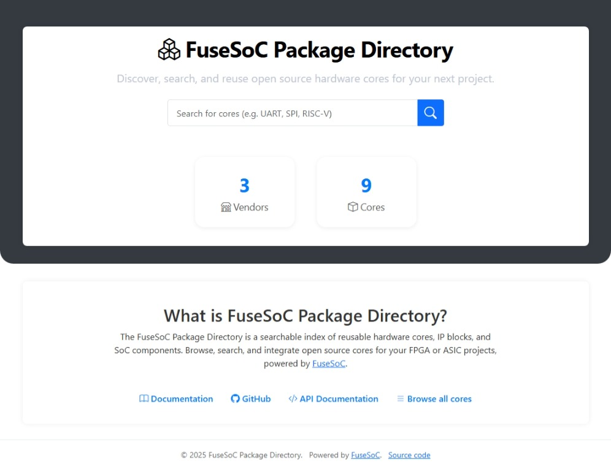

[](https://github.com/fusesoc/fusesoc-webserver/actions/workflows/ci.yml)
[](https://github.com/fusesoc/fusesoc-webserver/actions/workflows/docs.yml)
[](https://github.com/fusesoc/fusesoc-webserver/actions/workflows/docker.yml)
[](https://fusesoc.github.io/fusesoc-webserver/)
# FuseSoC Package Database (FuseSoC-PD)

FuseSoC Package Database (FuseSoC-PD) is a web-based platform and RESTful API designed to manage, validate, and distribute [FuseSoC](https://fusesoc.github.io/) core packages. It provides both a user-friendly web interface and a robust API for interacting with a centralized collection of hardware IP cores, making it easier for developers and organizations to share, discover, and reuse hardware designs.

The system is built with Django and Django REST Framework, and uses a GitHub repository as the canonical source of truth for all core package data. Core files are stored, retrieved, and versioned directly on GitHub, ensuring transparency and traceability. The application supports core file validation against both JSON schemas and FuseSoC’s own parser, and allows users to publish new cores or validate existing ones through the API or web UI.

**Key features include:**
- 🖥️ **Web UI** for browsing, searching, and viewing details of available cores, vendors, and libraries.
- 🔗 **REST API** for programmatic access to core listing, download, validation, and publishing.
- 🔒 **GitHub Integration** for storing and retrieving core files, ensuring all data is version-controlled and easily auditable.
- 🔄 **Automated Database Initialization** from the GitHub repository.
- 📄 **OpenAPI Documentation** with interactive Swagger and ReDoc interfaces.
- 🚦 **Rate Limiting** and security best practices for safe public deployment.

FuseSoC-PD is ideal for teams and communities who want a reliable, transparent, and automated way to manage their FuseSoC core libraries, with the flexibility of both web and API access.

---

## Table of Contents

- [Quick Start](#quick-start)
- [Database Consistency & Initialization](#database-consistency--initialization)
- [API Endpoints](#api-endpoints)
- [Web UI](#web-ui)
- [SPDX License List Management](#spdx-license-list-management)
- [Environment Variables](#environment-variables)
- [Development](#development)
  - [VS Code Configuration](#vs-code-configuration)
- [Notes](#notes)
- [License](#license)

---

## Quick Start

1. **Clone & Configure**
    ```bash
    git clone <your-repo-url>
    cd <your-repo-directory>
    cp .env.example .env  # Copy example env and edit as needed
    ```

2. **Build & Run with Docker**
    ```bash
    docker compose up --build
    ```
    App runs at [http://localhost:8000](http://localhost:8000).

---

## Database Consistency & Initialization

**Note:**
The database is not the primary source of truth. All core package data is stored in a configured GitHub repository.
**If the database is empty on application startup, it will automatically be initialized from the GitHub repository.**
This ensures the database always matches the repository contents. You can also manually re-initialize the database at any time using:

```bash
python manage.py init_db
```

- This command clones the GitHub repo, reads all `.core` and `.sig` files, and populates the database accordingly.
- The database can always be rebuilt from the GitHub repo, ensuring consistency with the repository contents.
- **Do not rely on the database as a persistent store for core data; GitHub is the canonical source.**


**Note:**
*If you update the SPDX license list while the server is running, the changes will only take effect after you restart the application/server. This ensures the new license data is loaded into memory.*

The command downloads the latest SPDX license list and stores it at the path specified by the `SPDX_LICENSES_PATH` setting in your Django configuration.

---

## API Endpoints

All endpoints are under `/api/v1/`:

| Endpoint                   | Method | Description                              |
|----------------------------|--------|------------------------------------------|
| `/health/`                 | GET    | API health check                         |
| `/list/?filter=...`        | GET    | List available core packages             |
| `/<package_name>/get/`     | GET    | Download a `.core` file                  |
| `/validate/`               | POST   | Validate a core file (`multipart/form`)  |
| `/publish/`                | POST   | Publish a core file to GitHub            |

---

## Web UI
Easily search and browse packages in a clean interface.



- `/` — Landing page (core and vendor counts)
- `/cores/` — List all core packages (with optional search)
- `/core/<id>/` — Core detail by database ID
- `/cores/<vendor>/<library>/<core>/<version>/` — Core detail by VLNV (vendor, library, name, version)
- `/vendors/` — List all vendors (with optional search)
- `/vendors/<sanitized_name>/` — Vendor detail (with libraries and projects)

---

## SPDX License List Management

FuseSoC-PD uses the [SPDX license list](https://spdx.org/licenses/) to validate and display license information for core packages.

- The license list is automatically updated when running the Docker container.
- You can manually update the license list at any time by running:

    ```bash
    python manage.py update_spdx_licenses
    ```

---

## Environment Variables

All required environment variables are listed in `.env.example`.
Copy this file to `.env` and update the values as needed.

---

## Development

To set up a development environment for FuseSoC-PD:

1. **Clone the repository:**
    ```bash
    git clone https://github.com/fusesoc/fusesoc-pd.git
    cd fusesoc-pd
    ```

2. **Set up a virtual environment:**
    ```bash
    python3 -m venv venv
    source venv/bin/activate
    ```

3. **Install development dependencies:**
    ```bash
    pip install -r requirements-dev.txt
    ```

4. **Apply database migrations:**
    ```bash
    python manage.py migrate
    ```

5. **Run the development server:**
    ```bash
    python manage.py runserver
    ```

6. **(Optional) Build documentation locally:**
    ```bash
    sphinx-build -b html docs/source docs/build
    # Open docs/build/index.html in your browser
    ```

---

### VS Code Configuration

This repository includes recommended Visual Studio Code settings and launch configurations for a smooth development experience.

- **Debug Django server:**
  Launch the Django development server with the built-in debugger.

- **Debug tests:**
  Easily debug individual test files.

- **Pytest integration:**
  Pytest is enabled by default for test discovery and running tests.

> **Tip:** It is recommended to create and select a Python virtual environment (`venv`) in VS Code for isolated development.

**To use:**
1. Open the project folder in VS Code.
2. **Create a virtual environment:**
   Open the Command Palette (`Ctrl+Shift+P`), type `Python: Create Environment`, and follow the prompts to create and select a `venv`.
3. **Install development dependencies:**
    ```bash
    pip install -r requirements-dev.txt
    ```
4. The `.vscode/launch.json` provides:
    - `Debugpy: Server` — runs and debugs the server.
    - `Debugpy: Pytest (Current File)` — runs and debugs single test file.
5. The `.vscode/settings.json` configures VS Code to use `pytest` for testing.
---

## Notes

- **API rate limit:** 100/hour for every users.
- **Static files:** Collected to `/staticfiles` in Docker.
- **Development:** Set `DJANGO_DEBUG=True`.
- **Database:** If empty, will be auto-initialized from GitHub on startup. You can also re-initialize manually with python `manage.py init_db`.

---

## License

FuseSoC is licensed under the permissive 2-clause BSD license, freely allowing use, modification, and distribution of FuseSoC Package Directory for all kinds of projects.

For more details, see the [LICENSE](LICENSE) file.
